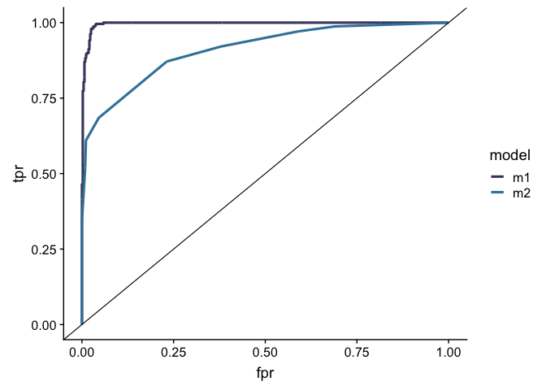

tidyroc
=======

This is a repository for an R package `tidyroc`. `tidyroc` is currently
under development, and I plan to release it this summer (summer 2019).

Usage
-----

`tidyroc` has 3 primary functions:

-   `make_roc()` calculates true positive and false positive rates to
    plot a receiver operating characteristic (ROC) curve
-   `make_pr()` calculates presicion and recall (true positive rate) to
    plot a precision-recall curve  
-   `calc_auc()` calculates the area under an ROC (AUC)

`tidyroc` is designed to be integrated with the Tidyverse. It is
intended to work with `broom`, `dplyr`, and `ggplot2`. Here is a simple
use case.

    glm(outcome ~ predictor1 + predictor2 + predictor3, # fit a model using 3 predictors
      data = df,
      family = binomial
    ) %>%
      augment() %>% # use broom to add glm output to the original data frame
      make_roc(predictor = .fitted, known_class = Species) %>% # get values to plot an ROC curve
      ggplot(aes(x = fpr, y = tpr, color = model)) + # plot false positive rate against true positive rate
      geom_line(size = 1.1)

Examples
--------

Before I make any plots, I fit two logitistic regression models. I will
use the `iris` dataset for this purpose. First, I reduce `iris` to only
contain data for two species of irises. This ensures that the outcome is
binary.

I load the libraries needed to run the examples below.

    # load tidyverse packages
    library(ggplot2)
    library(dplyr)
    library(broom)

    # load cowplot to change plot theme
    library(cowplot)

    # load tidyroc
    devtools::load_all(".")

I reduce the `iris` dataset to contain information only about virginica
and versicolor. I fit two logistic regression models that attempt to
predict the two species of irises. The first model tries uses petal
width, petal length, and sepal width as predictors. The second model
uses only sepal width as a predictor.

    # reduce iris to two species to fit a model that is a binary classifier
    iris.small <- filter(iris, Species %in% c("virginica", "versicolor"))

    # fit a logistic regression model to the data to assess the model's performance
    glm.out1 <- glm(Species ~ Petal.Width + Petal.Length + Sepal.Width,
      data = iris.small,
      family = binomial
    ) %>%
      augment() %>%
      mutate(model = "model1") # name the model

    ## Warning: glm.fit: fitted probabilities numerically 0 or 1 occurred

    # fit a different logistic regression model to the data to assess this model's performance
    glm.out2 <- glm(Species ~ Sepal.Width,
      data = iris.small,
      family = binomial
    ) %>%
      augment() %>%
      mutate(model = "model2") # name the model

    # combine the two datasets to make an ROC curve for each model
    glm.out <- bind_rows(glm.out1, glm.out2)

Now that I have fitted values, I can make a plot with two ROC curves and
a plot with two precision-recall curves. I can also calculate the area
under each of the ROC curves.

#### Plot ROC curves for 2 different models

    # plot ROC curves
    glm.out %>%
      group_by(model) %>% # group to get individual ROC curve for each model
      make_roc(predictor = .fitted, known_class = Species) %>% # get values to plot an ROC curve
      ggplot(aes(x = fpr, y = tpr, color = model)) +
      geom_line(size = 1.1) +
      scale_color_manual(values = c("#001889", "#AB1488")) +
      theme_cowplot()

#### Plot precision-recall curves for 2 different models

    # plot precision-recall curves using the data-frame we generated in the previous example
    glm.out %>%
      group_by(model) %>% # group to get individual precision-recall curve for each model
      make_pr(predictor = .fitted, known_class = Species) %>% # get values to plot a precision-recall curve
      ggplot(aes(x = recall, y = precision, color = model)) +
      geom_line(size = 1.1) +
      coord_cartesian(ylim = c(0,1), xlim = c(0,1)) +
      scale_color_manual(values = c("#001889", "#AB1488")) +
      theme_cowplot()

#### Calculate AUC of two ROC curves

    glm.out %>%
      group_by(model) %>% # group to get individual precision-recall curve for each model
      make_roc(predictor = .fitted, known_class = Species) %>% 
      summarise(auc = calc_auc(x = fpr, y = tpr))

    ## # A tibble: 2 x 2
    ##   model    auc
    ##   <chr>  <dbl>
    ## 1 model1 0.997
    ## 2 model2 0.664
